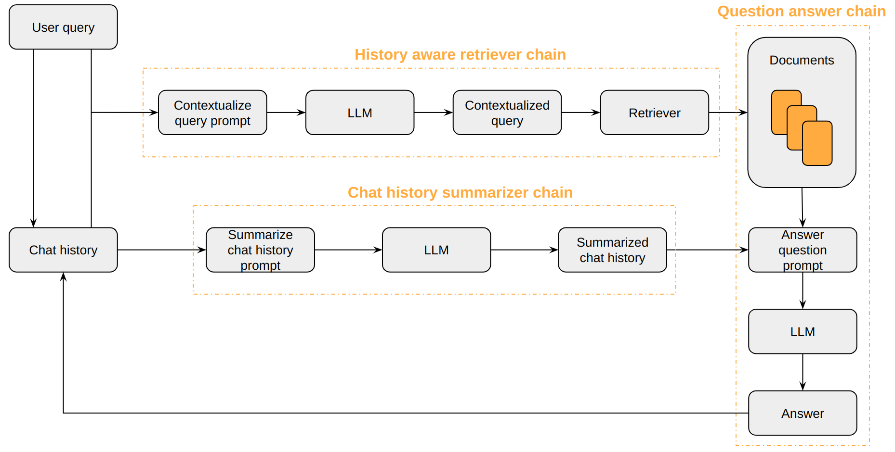

# Overview

This project is a technical assessment that consists of implementing a RAG-based chatbot system to QA data from eLife and BioRxiv (deployed here: https://ifqeuyddicvujnpsubx9bc.streamlit.app/).

## Packages and Models

### LangChain

LangChain is used to build the core pipeline for the RAG process, the Chatbot, and their integration. It also handles PDF parsing, document transformation, chat history handling, and prompt handling.

### Ollama

Ollama was selected due to my computer's limited computing capacity. It simplifies the use of quantized models, improving efficiency without significantly compromising model quality or performance.

- **LLM Choice**: [microsoft/Phi-3-mini-128k-instruct](https://ollama.com/library/phi3:3.8b-instruct) is chosen for its compact size and high performance. It supports a large context window of around 128k tokens, ideal for maintaining a large memory of contextual information in a chat scenario.


### HuggingFace

HuggingFace serves multiple roles in this project:
  
- **Summarizer Model**: [pszemraj/long-t5-tglobal-base-sci-simplify-elife](https://huggingface.co/pszemraj/long-t5-tglobal-base-sci-simplify), fine-tuned on scientific article summarization tasks. This model is wrapped with [textsum](https://github.com/pszemraj/textsum) to condense XMLs and PDFs into a format suitable for the embedding model's context window.
  
- **Embedding Model**: [Alibaba-NLP/gte-large-en-v1.5](https://huggingface.co/Alibaba-NLP/gte-large-en-v1.5) is selected based on the [MTEB Leaderboard](https://huggingface.co/spaces/mteb/leaderboard) criteria for memory usage (1.62 GB), large context window (Max Tokens: 8192), model size (434 million parameters), and retrieval performance.

- **LLM Choice**: [microsoft/Phi-3-mini-4k-instruct](https://huggingface.co/microsoft/Phi-3-mini-4k-instruct) is used via the HuggingFace Inference Endpoint providing fast inference. However, it comes with a drawback: its context window is limited to 4096 tokens, whereas Ollama offers Phi-3-mini with a context window of 128k tokens.

### Streamlit


Streamlit provides an intuitive interface for easy interaction with the chat application and simplifies deployment through the Streamlit Hub, offering free hosting for Streamlit apps.

# Data

The dataset consists of scientific articles collected from two primary sources: [BioRxiv](https://www.biorxiv.org/) and [eLife](https://elifesciences.org/). The data is sourced from three distinct repositories:

1. **HuggingFace Dataset (eLife)**:
   - Dataset ID: [pszemraj/scientific_lay_summarisation-elife-norm](https://huggingface.co/datasets/pszemraj/scientific_lay_summarisation-elife-norm/viewer)
   - Data Format: Parquet

2. **BioRxiv API**:
   - Access scientific articles directly from the BioRxiv API.
   - [Documentation](https://api.biorxiv.org/) for accessing the data through the API.
   - Data Format: PDF

3. **eLife GitHub Repository**:
   - XML files extracted from the [eLife GitHub repository](https://github.com/elifesciences/elife-article-xml).
   - Data Format: XML


# Setup

## Clone the Repository
First, clone the project repository to your local machine using the following command:

```bash
git clone https://github.com/y-aoub/rag_qa_system/tree/master
cd rag_qa_system
```

## Creating a Virtual Environment
Create a virtual environment to isolate package dependencies. Use one of the following methods:

- Using Python's built-in venv module:
  ```bash
  python -m venv [environment_path]
  ```
  
- Using the virtualenv package:
  ```bash
  virtualenv [environment_path]
  ```

## Activating the Environment
Activate the virtual environment by running:
```bash
source [environment_path]/bin/activate
```

## Installing Dependencies
Install the required Python packages using:
```bash
pip install -r requirements.txt
```
## Set HuggingFace API Token

In the `.env` file, add your HuggingFace API token as follows:

```
HUGGINGFACE_API_TOKEN = "your_hf_api_token"
```
Refer to this [link](https://huggingface.co/docs/api-inference/en/quicktour#get-your-api-token) to see how to generate an API token.

# Run

This chatbot can be accessed using two different interfaces: a command-line interface and a web-based interface using Streamlit.

## Running the CLI

You can interact with the chatbot directly from the command line by running:

```bash
python main.py [--embedding_device] [--n_files] [--n_docs] [--build_vector_store] [--use_ollama]
```

- `--embedding_device`: Device for embeddings (default is 'cpu'). Options are 'cpu' and 'cuda'.

- `--n_files`: Number of PDFs and XMLs to extract and process (default is 5).

- `--n_docs`: Number of documents to retrieve through MMR similarity search (default is 2).

- `--build_vector_store`: Flag to build Chroma vector store after fetching, processing, and parsing the data (default is False; if not specified, Chroma vector store will be checked for existence and integrity, and downloaded from the drive if necessary).

- `--use_ollama`: Flag to use Ollama as the LLM server; otherwise, it defaults to using the HuggingFace API Inference Endpoint (default is False).

## Running the Streamlit App

Alternatively, you can use a web-based interface to interact with the chatbot. Run the following command to start the Streamlit app:

```bash
streamlit run app.py [-- [--embedding_device] [--n_files] [--n_docs] [--build_vector_store] [--use_ollama]]
```
 
The application is deployed on a Streamlit Cloud instance and can be tested [here](https://ifqeuyddicvujnpsubx9bc.streamlit.app/).

# Architecture



## Chat History Summarizer Chain and Memory Buffer
In this chat system, the memory buffer starts empty at the beginning of each conversation. After each exchange, the buffer is updated in this format:

```
- Human: What is insomnia?
- AI Assistant: Insomnia is a sleep disorder where individuals have difficulty falling or staying asleep, affecting daytime functioning.
- Human: Who can suffer from insomnia?
- AI Assistant: Insomnia can affect anyone, regardless of age, gender, or background.
...
```

Since microsoft/Phi-3-mini-4k-instruct has a context window of 4096 tokens, which means that the chat history should be managed carefully to prevent losing important information if the chat history gets larger.

The chat history is important for tracking topic changes that can be made by the user. To achieve this, the approach here involves using the same LLM to summarize the chat history after each interaction with the chatbot; this process gradually reduces the size of the chat history and gives less importance to older interactions compared to newer ones. 

The summary of the chat history will look something like this:

```
- Human: What is insomnia?
- AI Assistant: Difficulty sleeping, affecting daytime function.
- Human: Who can suffer from insomnia?
- AI Assistant: Anyone.
...
```

For details about the instructions given to the model to summarize the chat history, refer to this [prompt template](data/prompts/chat_summarizer.txt).

## History Aware Retriever Chain
The history aware retriever chain contextualizes user questions taking into account the summarized chat history if it is not empty. This ensures that references to previous interactions are understood and handled by the chatbot accurately. The process is as follows:

First, we define a sub-chain that takes historical messages and the latest user question, reformulating the question if it references any information from past interactions.

For this sub-process a [prompt template](data/prompts/question_contextualizer.txt) is used including a placeholder for the chat history and the initial user query. The chat history is inserted after the system instructions and the initila user query is given after the chat history. The result is a contextualized query.

Here is an example of this sub-process:

```
* Chat history: 
  - Human: What is insomnia?
  - AI Assistant: Insomnia is a sleep disorder where individuals have difficulty falling or staying asleep.
* User query: Who can suffer from it?
* Reformulated user query: Who can suffer from insomnia?
```

The contextualized query is given to the retriever, which use the maximal marginal relevance similarity to retrieve the relevant documents to the contextualised query (default: 2 documents).

## Question Answer Chain
The question answer chain is the main component of the architecture, it uses a [prompt template](data/prompts/question_answerer.txt) with a place holder for the retrieved documents as well as the summarized chat history and the user query.

The output is a formulated answer generated by the LLM considering the retrieved documents used as a context as well as the summarized chat history.

Here is an example of all the necessary components used to answer a question asked by the user during a chat session:

```
* Chat history: 
  - Human: What is insomnia?
  - AI Assistant: Insomnia is a sleep disorder where individuals have difficulty falling or staying asleep.
* Summarized chat history: 
  - Human: What is insomnia?
  - AI Assistant: Difficulty sleeping, affecting daytime function.

* User query: Who can suffer from it?
* Reformulated user query: Who can suffer from insomnia?

* Retrieved context:
  - People often feel fatigued and sleepy when they are sick. Other animals also show signs of sleepiness when ill – they stop eating, move less, and are less responsive to changes in their environment. Sickness-induced sleep helps both people and other animals to ...
  - The experiments sifted through genetic mutations to determine which ones cause the worms not to fall asleep when FLP-13 is released. This revealed that worms with a mutation that causes them to lack a receptor protein called DMSR-1 do not become sleepy in response to FLP-13 ...

* Answer: Insomnia can affect anyone, regardless of age, gender, or background.
```

The process ensures that each user query is answered with consideration of the chat history for context, relevant documents are retrieved to provide accurate information, and the final answer is synthesized to be as informative as possible. 